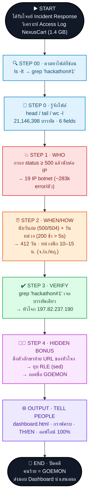
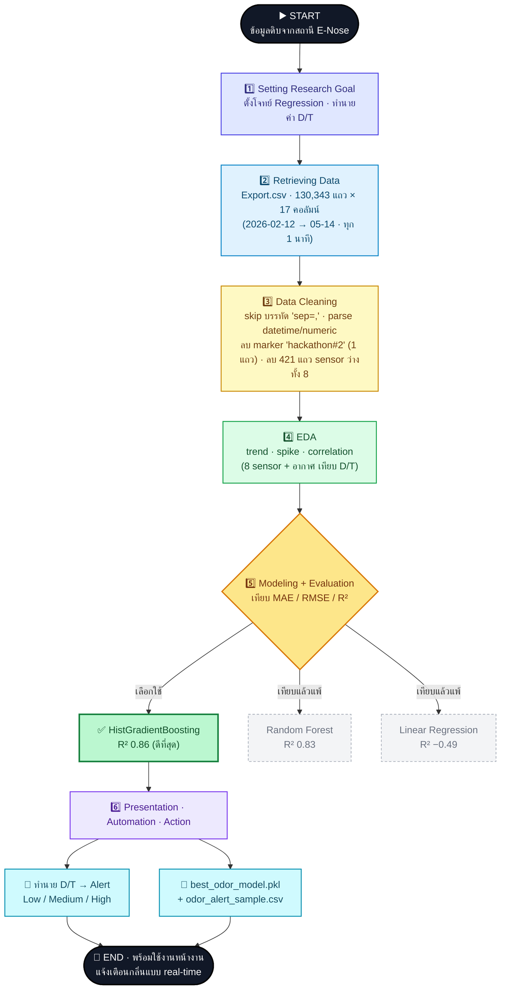

# 🕵️ THE SILENT THREAT — Hackathon Mission (hackathon#1)

> *"Behind the screen, a silent war is raging."*
> ภารกิจสืบสวน Incident Response — วิเคราะห์ Access Log ของระบบ **NexusCart** ขนาด **1.4 GB / 21,146,398 บรรทัด** เพื่อตามล่ากลุ่มแฮกเกอร์ และถอดชื่อจริงของคนร้าย


> 📦 **รีโพนี้รวม 2 โปรเจกต์:** ส่วนแรก **hackathon#1 — THE SILENT THREAT** (Log Forensics · `awk`/`grep`/`sed`) · ส่วนที่สอง **hackathon#2 — 👃 E-Nose Odor Detection** (Machine Learning · Python) อยู่ถัดลงไปด้านล่าง

---

## 👥 HackathonGroup3 — Group Members

### 🎓 ชั้นปี 3
| ชื่อ–สกุล | รหัสนักศึกษา |
|-----------|--------------|
| นาย ปาณัสม์ ตูพานิช | 6710301011 |
| นาย ธนัท จงธีรธนโชติ | 6710301032 |
| นาย ภากร กาเงิน | 6710301037 |
| นาย มูฮัมหมัดฮาซัน อุเซ็ง | 6710301025 |
| นาย เจตน์ - | 6710301022 |

### 🎓 ชั้นปี 2
| ชื่อ–สกุล | รหัสนักศึกษา |
|-----------|--------------|
| นาย สุวิจักขณ์ ไพศาลภาณุมาศ | 6850301003 |
| นาย ธารา งามสง่า | 6810301030 |
| นาย Souvanhpheng Sydavong | 6810301029 |
| นาย ณัฐภัทร ศรีคชไกร | 6810301024 |

---

## 🎯 ภารกิจ (Mission Objectives)

| # | ภารกิจ | คำตอบ |
|---|--------|-------|
| 1 | **WHO ARE THEY?** — ระบุ IP ทั้งหมดของกลุ่มแฮกเกอร์ | **19 IP** (botnet) |
| 2 | **WHEN & HOW?** — หา Pattern และช่วงเวลาที่ระบบผิดปกติ | 412 วัน · ล่ม 302 / หน่วง 131 |
| 3 | **TELL PEOPLE** — แสดงผลเป็น Web App (Dashboard) | `dashboard.html` |
| 4 | **HIDDEN BONUS** — ตามหาชื่อจริงของคนร้าย | **`GOEMON`** |

---

## 📂 โครงสร้างไฟล์ (Files)

| ไฟล์ | คำอธิบาย |
|------|----------|
| `dashboard.html` | 🌐 เว็บแดชบอร์ดนำเสนอผล (เปิดได้เลย ออฟไลน์ 100% รองรับ TH/EN) |
| `solution.txt` / `solution.sh.zip` | 🐚 สคริปต์ bash วิเคราะห์ทั้งหมด (อ่านได้จาก `.txt` · ไฟล์รันอยู่ใน `.sh.zip`) รันซ้ำได้ |
| `attackers.csv` | ข้อมูล 19 IP คนร้าย + สถิติ status / ช่วงเวลา |
| `attackers_ip_list.txt` | รายชื่อ IP คนร้ายล้วน (19 รายการ) |
| `timeline_daily.csv` | ไทม์ไลน์รายวันครบ 731 วัน (2024-06-10 → 2026-06-10) — โจมตี 412 วัน |
| `attack_by_hour.csv` | สรุปการโจมตีราย "ชั่วโมง" (00–23) แยกล่ม (500/504) / หน่วง (200 > 5s) |
| `attack_by_weekday.csv` | สรุปการโจมตีราย "วันในสัปดาห์" + จำนวนวันจริงที่ถูกโจมตี |
| `weekday_hour_analysis.py` | สคริปต์ Python วิเคราะห์ ชั่วโมง × วัน พร้อม heatmap |
| `flowchart_hackathon1.png` / `.mmd` | 🗺️ ผังกระบวนการสืบสวน (ภาพ PNG + ซอร์ส Mermaid) |

> ⚠️ ไฟล์ข้อมูลดิบ `cart_web.log` (1.4 GB · 21,146,398 บรรทัด) ไม่ได้รวมไว้ในรีโพเพราะมีขนาดใหญ่

---

## 🔬 วิธีการสืบสวน (Methodology)

วิเคราะห์ด้วย **command-line ของ Linux ล้วน** (`awk`, `grep`, `sed`) — ไม่ใช้ฐานข้อมูลหรือ AI
**แนวคิดหลัก:** *"request ปกติ → ตอบเร็ว + status 200 · request โจมตี → ตอบช้า + error"*

โครงสร้าง log (6 fields คั่นด้วย ` | `):
```
2024-06-10 04:17:43 | 39.3.141.152 | POST | /checkout | 200 | 122
   timestamp         |      IP       | method|   url    |status| response_time(ms)
```

### 🗺️ Flowchart การทำงาน (hackathon#1)



### STEP 00 — ตามหาไฟล์ที่อาจารย์ซ่อนไว้
ไฟล์ถูกซ่อนใน path `/home/bootcamp/clmystery/mystery/streets/locked` — ใช้ `ls -lt` หาไฟล์ที่เพิ่งถูกเพิ่ม แล้วยืนยันด้วย keyword
```bash
cd /home/bootcamp/clmystery/mystery/streets/locked
ls -lt                                 # เรียงตามเวลาล่าสุด → เจอ cart_web.log
grep -an "hackathon#1" cart_web.log    # ยืนยันว่าเป็นไฟล์เป้าหมายจริง
```

### STEP 01 — WHO: หากลุ่ม IP คนร้าย
กรอง error (status ≥ 500) แล้วนับต่อ IP
```bash
awk -F' [|] ' '$5>=500{c[$2]++} END{for(i in c)print c[i],i}' cart_web.log | sort -rn | head -25
```
✅ พบ **19 IP** ที่ยิงเท่ากันหมด (~283,000 error/ตัว) → botnet ทีมเดียวกัน

### STEP 02 — WHEN & HOW: วิเคราะห์ Pattern ตามเวลา
แยกนับ "ล่ม" (500/504) และ "หน่วง" (200 + response > 5000ms)
```bash
# วันที่ระบบล่ม
awk -F' [|] ' '$5>=500{c[substr($1,1,10)]++} END{for(d in c)print d,c[d]}' cart_web.log | sort
# วันที่ระบบหน่วง
awk -F' [|] ' '$5==200 && $6>5000{c[substr($1,1,10)]++} END{for(d in c)print d,c[d]}' cart_web.log | sort
```
✅ โจมตี **412 วัน** → ล่ม 302 วัน + หน่วง 131 วัน (เกิดทั้งสองในวันเดียว 21 วัน)
- **"ล่ม" (500/504)** กระจายตัวทุกชั่วโมง/ทุกวันสม่ำเสมอ
- **"หน่วง" (200 ช้า > 5s)** เจาะจงมาก — เกิดเฉพาะชั่วโมง **10, 11, 13, 14, 15 น. (เว้นเที่ยง 12:00)** และเฉพาะวัน **จันทร์ / อังคาร / พฤหัสบดี** เท่านั้น

### STEP 03 — VERIFY: ยืนยันไฟล์จริง + หาหัวโจก
```bash
grep -an "hackathon#1" cart_web.log
```
✅ keyword `hackathon#1` ฝังในไฟล์แค่ **บรรทัดเดียว** ผูกกับ IP **`197.82.237.190`** = หัวโจก

### STEP 04 — HIDDEN BONUS: ถอดชื่อคนร้าย
คนร้ายฝัง "ลายเซ็นดิจิทัล" โดยเติมตัวอักษร 1 ตัวท้าย URL (`/productsE`) ยิงซ้ำแบบ **Run-Length Encoding** → ดึงตัวท้ายมาต่อกัน แล้วยุบตัวซ้ำด้วย `sed`
```bash
grep -a "| 197.82.237.190 |" cart_web.log \
 | awk -F' [|] ' '{u=$4; sub(/\.html$/,"",u);
     b=substr(u,1,length(u)-1);
     if(b ~ /^\/(search|cart|checkout|products|index|api\/v1\/user)$/)
        printf "%s", substr(u,length(u),1)}' \
 | sed 's/\(.\)\1*/\1/g' | tr '_' ' '
```
✅ ถอดได้ข้อความเต็ม (run-length ยุบตัวซ้ำ ทำให้ `TOO→TO`, `FALLING→FALING`):
```
NEXUS CART WAS TOO EASY. YOUR SYSTEM WAS ALREADY FALLING APART
BEFORE YOU EVEN REALIZED. IT WAS ME — GOEMON
```
> ข้อความนี้วนซ้ำต่อเนื่องตลอด log ของหัวโจก → ลายเซ็นปิดท้าย **`GOEMON`**

---

## 🏴‍☠️ คำตอบสุดท้าย (Final Answer)

| ภารกิจ | ผลลัพธ์ |
|--------|---------|
| 🔍 **WHO** | 19 IP — หัวโจก `197.82.237.190` |
| ⏰ **WHEN & HOW** | 2024-06-13 → 2026-06-10 · DDoS botnet · ล่ม 302 วัน / หน่วง 131 วัน · ช่วงหน่วงพีก 10:00–15:00 น. (เว้นเที่ยง · เฉพาะ จ./อ./พฤ.) |
| 🏴‍☠️ **HIDDEN BONUS** | ชื่อคนร้าย = **`GOEMON`** |

### 🎯 รายชื่อ IP คนร้ายทั้ง 19 ตัว
```
209.103.8.44     162.240.218.117  197.82.237.190 ★  215.143.100.205
199.242.130.73   119.123.55.141   148.9.19.27       187.91.79.110
196.45.2.86      199.71.56.65     14.121.165.122    202.129.225.117
211.92.75.1      95.125.101.128   14.252.124.193    80.130.43.26
139.94.203.41    12.104.185.44    131.33.12.73
```
> ★ = หัวโจก (ringleader) ที่ซ่อนชื่อ `GOEMON` ไว้

---

## 🚀 วิธีเปิด Dashboard

```bash
# macOS
open dashboard.html
# หรือดับเบิลคลิกไฟล์ใน File Explorer ได้เลย
```

**Dashboard features:**
- 📊 กราฟวิเคราะห์ครบ (IP, timeline, ชั่วโมง, HTTP status)
- 🎬 อนิเมชันถอดรหัส Secret Message แบบ live
- 🌐 ปุ่มสลับภาษา **TH / EN**
- 📴 **ออฟไลน์ 100%** — ฝัง Chart.js + ฟอนต์ในไฟล์ ไม่ต้องต่อเน็ต

---

## 🛠️ Tech Stack
`bash` · `awk` · `grep` · `sed` · `Chart.js` · `HTML/CSS/JS`

---
# 👃 E-Nose Odor Intensity Evaluation & Anomaly Detection

โปรเจกต์วิเคราะห์ข้อมูลและสร้างโมเดล Machine Learning เพื่อประเมินความเข้มข้นของกลิ่น (Dilution-to-Threshold: D/T Ratio) จากสถานีตรวจวัดกลิ่นต่อเนื่อง (Electronic Nose) เพื่อตรวจจับเหตุการณ์ผิดปกติ (Anomaly Detection) และสนับสนุนการตัดสินใจของหน้างาน (โรงงาน/โรงบำบัดน้ำเสีย) ในการตอบสนองต่อข้อร้องเรียนของชุมชนรอบข้างได้อย่างมีหลักฐานและรวดเร็ว

## 📌 บริบทและเป้าหมายของโครงการ (Research Goal)
หน้างานประสบปัญหาชุมชนรอบข้างร้องเรียนเรื่องกลิ่นรบกวนบ่อยครั้ง ผู้บริหารและผู้จัดการจึงต้องการเครื่องมือที่ช่วยให้:
1. เข้าใจสถานการณ์ความรุนแรงของกลิ่นจากข้อมูล Sensor ทั้ง 8 ตัว และปัจจัยสภาพอากาศ
2. ตอบข้อร้องเรียนจากชุมชนได้อย่างมีหลักฐานอ้างอิงทางวิทยาศาสตร์
3. ตัดสินใจแก้ปัญหาได้ทันท่วงทีว่าควรเข้าตรวจสอบและแก้ไขที่จุดใด เมื่อใด

**เป้าหมายสูงสุด:** *"ประเมินความเข้มข้นของกลิ่น (D/T) จากค่าของ sensor ทั้ง 8 ตัว และตรวจจับช่วงเวลาที่กลิ่นผิดปกติ เพื่อสนับสนุนการตัดสินใจของหน้างาน"*

---

## 🛠️ กระบวนการทำงาน (Data Science Process)

โครงการนี้ดำเนินการตามกระบวนการ Data Science Process ทั้งหมด 6 ขั้นตอน ดังนี้:

### 🗺️ Flowchart การทำงาน (hackathon#2)



### Step 1 — Setting the Research Goal
* กำหนดโจทย์ธุรกิจและตัวชี้วัด แปลงปัญหาเรื่องกลิ่นรบกวนให้เป็นโจทย์การทำ Regression เพื่อทำนายค่าความเข้มข้นของกลิ่น (D/T) 

### Step 2 — Retrieving Data
* ข้อมูลดิบมาจากไฟล์ `Export.csv` ซึ่งบันทึกค่าจากสถานี E-Nose ทุกๆ **1 นาที** ต่อเนื่องเป็นเวลาประมาณ **91 วัน**
* ขนาดข้อมูลเริ่มต้น: `130,343 แถว, 17 คอลัมน์` (ช่วงเวลา 2026-02-12 ถึง 2026-05-14)
* **สิ่งที่พบจากการสำรวจเบื้องต้น (Initial Exploration):**
  * พบ Excel Dialect (`sep=,`) ในบรรทัดแรกของไฟล์
  * มีข้อมูลสูญหาย (Missing Values) ของกลุ่ม Sensor อยู่ประมาณ 0.32% (421 แถว)
  * คอลัมน์ `Smell Prediction` มีข้อมูลเป็น NaN ถึง 34% และมีเพียงค่าเดี่ยวคือ "Ambient" ไม่สะท้อนโปรไฟล์กลิ่นอื่น จึงตัดสินใจใช้ `D/T` เป็น Target Variable แทน

### Step 3 — Data Preparation & Cleaning
* ทำการ Skip Row แรกเพื่อโหลดข้อมูลให้ถูกต้อง และตัดช่องว่าง (Whitespace) ออกจากชื่อคอลัมน์
* แปลงคอลัมน์ `Time` ให้เป็น Datetime object และคอลัมน์ที่เหลือให้เป็น Numeric type
* ลบแถวที่เป็นข้อมูลประเภท Marker ซึ่งไม่ใช่ข้อมูลจริงออก (เช่น แถวที่มีค่า `hackathon#2`)
* จัดการกับแถวที่ Sensor ทั้ง 8 ตัวว่างพร้อมกัน (`NaN`) โดยการลบออกเนื่องจากเป็นสัญญาณรบกวนหรือช่วงเครื่องดับ (ระบบ Error)

### Step 4 — Data Exploration (EDA)
* วิเคราะห์แนวโน้มค่าความเข้มข้นของกลิ่น (D/T) ตามช่วงเวลาเพื่อหา Pattern และ Cycle ของกลิ่น
* ตรวจสอบช่วงเวลาที่ค่าความเข้มข้นของกลิ่นพุ่งสูงผิดปกติ (Spike) เพื่อระบุเหตุการณ์ Anomaly
* วิเคราะห์ความสัมพันธ์ (Correlation Matrix) ระหว่างค่าจาก Sensor ทั้ง 8 ตัว, สภาพอากาศ (ทิศทางลม, ความเร็วลม, อุณหภูมิ, ความชื้น, ความกดอากาศ, PM 2.5) และค่า Target D/T

### Step 5 — Data Modeling & Evaluation
* พัฒนาโมเดล Machine Learning เพื่อทำนายค่า D/T Ratio โดยใช้ Features จากค่า Sensor, ข้อมูลสภาพอากาศ และข้อมูลกลุ่มเวลา (Time-based features)
* เปรียบเทียบประสิทธิภาพของโมเดลหลากประเภท และประเมินผลด้วย Metrics มาตรฐาน:
  * Mean Absolute Error (MAE)
  * Root Mean Squared Error (RMSE)
  * R-squared ($R^2$) เพื่อเลือกโมเดลที่ดีที่สุดไปใช้งาน

**ผลการเปรียบเทียบโมเดล (ทำนายค่า D/T):**

| โมเดล | MAE | RMSE | R² |
|------|-----|------|-----|
| **HistGradientBoosting** ★ | **0.3581** | **0.4998** | **0.8612** |
| Random Forest | 0.4129 | 0.5570 | 0.8276 |
| Linear Regression | 1.3971 | 1.6392 | −0.4931 |

> ★ โมเดลที่ดีที่สุด (RMSE ต่ำสุด · R² = 0.86) บันทึกไว้ที่ `best_odor_model.pkl`
> Linear Regression ได้ R² ติดลบ เพราะ extrapolate ช่วงกลิ่นแรงที่ไม่เคยเห็นไม่ได้ — โมเดลแบบ tree (RF/HGB) รับมือได้ดีกว่า

**ทดสอบพยากรณ์ล่วงหน้า (Model เทียบ Persistence baseline):**

| Horizon | Persistence RMSE | Model RMSE | ผู้ชนะ |
|--------:|-----------------:|-----------:|:------|
| 30 นาที | 0.7585 | 0.9152 | Persistence |
| 60 นาที | 0.9980 | 1.0659 | Persistence |
| 120 นาที | 1.3272 | 1.2543 | **Model** |
| 180 นาที | 1.5845 | 1.4774 | **Model** |

> สรุป: ระยะสั้น (30–60 นาที) ใช้ persistence ก็เพียงพอ — แต่ตั้งแต่ ~2 ชั่วโมงขึ้นไป โมเดลเริ่มชนะ (ที่ 120 นาที ดีกว่า 5.5%) เพราะ persistence ตามแนวโน้มขาขึ้นของกลิ่นไม่ทัน

### Step 6 — Presentation, Automation & Action
* นำเสนอผลลัพธ์ผ่านกราฟเปรียบเทียบค่าจริง (Actual) และค่าทำนาย (Predicted) เพื่อดูความแม่นยำ
* Export ผลลัพธ์การทำนายออกมาเป็นไฟล์ `.csv` สำหรับระบบอื่นนำไปใช้งานต่อ
* **สร้างฟังก์ชันอัตโนมัติ (Automation Function):** สำหรับรับข้อมูลชุดใหม่ (New data entry) เข้ามาทำนายค่า D/T ทันที พร้อมแปลงผลลัพธ์เป็นระดับการแจ้งเตือนกลิ่น (Odor Alert Levels) ได้แก่ **Low, Medium, และ High**

---

## 📊 โครงสร้างข้อมูล (Data Features)

| ชื่อฟีเจอร์ | รายละเอียด |
|---|---|
| `Time` | วันและเวลาที่บันทึกข้อมูล (บันทึกทุก 1 นาที) |
| `D/T` | Dilution-to-Threshold (ค่าความเข้มข้นของกลิ่น - **Target**) |
| `Sensor 1 - 8` | ค่าสัญญาณจากเซนเซอร์ตรวจวัดก๊าซทั้ง 8 ตัวของระบบ E-Nose |
| `Wind Direction` / `Wind Speed` | ทิศทางและความเร็วลม ณ ขณะนั้น |
| `Temperature` / `Relative Humidity` | อุณหภูมิและความชื้นสัมพัทธ์ในอากาศ |
| `PM 2.5` / `Atmospheric Pressure` | ปริมาณฝุ่น PM2.5 และความกดอากาศ |

---

## 📂 โครงสร้างไฟล์ (Files — hackathon#2)

| ไฟล์ | คำอธิบาย |
|------|----------|
| `enose_analysis_improved.ipynb` | 📓 Notebook วิเคราะห์หลัก (Data Science Process ครบ 6 ขั้นตอน) |
| `Export.csv` | ข้อมูลดิบจากสถานี E-Nose — 130,343 แถว × 17 คอลัมน์ |
| `best_odor_model.pkl` | 🤖 โมเดลที่ดีที่สุด (HistGradientBoosting) พร้อมใช้งาน |
| `odor_alert_sample.csv` | ตัวอย่างผลพยากรณ์ + ระดับแจ้งเตือน (Low / Medium / High) |
| `odor_presentation.pdf` | 🖥️ สไลด์นำเสนอผลโครงการ |
| `flowchart_hackathon2.png` / `.mmd` | 🗺️ ผัง Data Science Process (ภาพ PNG + ซอร์ส Mermaid) |

> ⚠️ ไฟล์ `Export.csv` ขึ้นต้นด้วยบรรทัด Excel dialect `sep=,` (ต้อง skip ก่อนโหลด) และมี marker `hackathon#2` แฝงอยู่ 1 แถว ซึ่งถูกลบออกตอนทำความสะอาดข้อมูล

---

## 💻 การติดตั้งและเริ่มต้นใช้งาน (Getting Started)

### Prerequisites
โปรแกรมและไลบรารีที่จำเป็นต้องใช้:
```text
python >= 3.8
pandas · numpy · scikit-learn · matplotlib · seaborn · jupyterlab
```

### วิธีรัน
```bash
# 1) ติดตั้งไลบรารี
pip install pandas numpy scikit-learn matplotlib seaborn jupyterlab

# 2) เปิด Notebook วิเคราะห์
jupyter lab enose_analysis_improved.ipynb

# 3) (ทางเลือก) โหลดโมเดลที่เทรนไว้แล้วเพื่อทำนายทันที
python -c "import pickle; m=pickle.load(open('best_odor_model.pkl','rb')); print(m)"
```

---

## 🛠️ Tech Stack (hackathon#2)
`Python` · `pandas` · `numpy` · `scikit-learn` (HistGradientBoosting) · `matplotlib` · `seaborn` · `Jupyter`

---

<div align="center">

**Together, we secure tomorrow.** 🛡️

*HackathonGroup3 · The Silent Threat (hackathon#1) · E-Nose Odor Detection (hackathon#2)*

</div>
